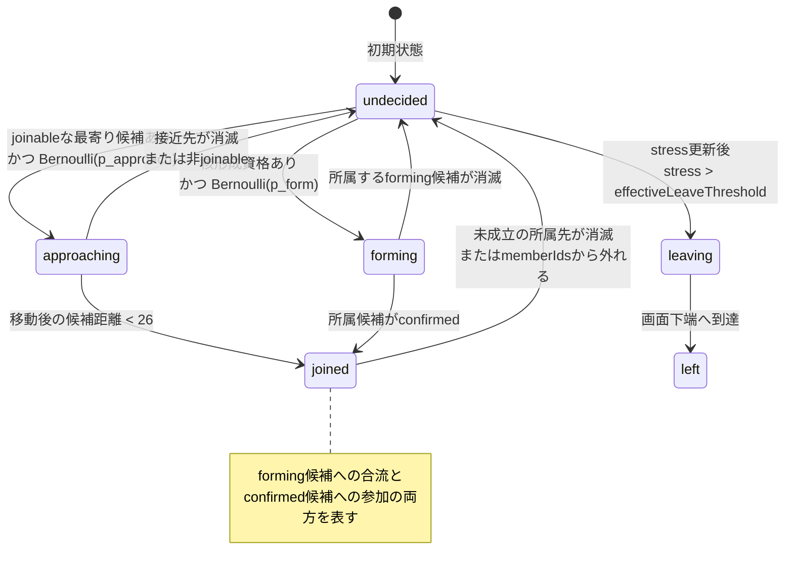
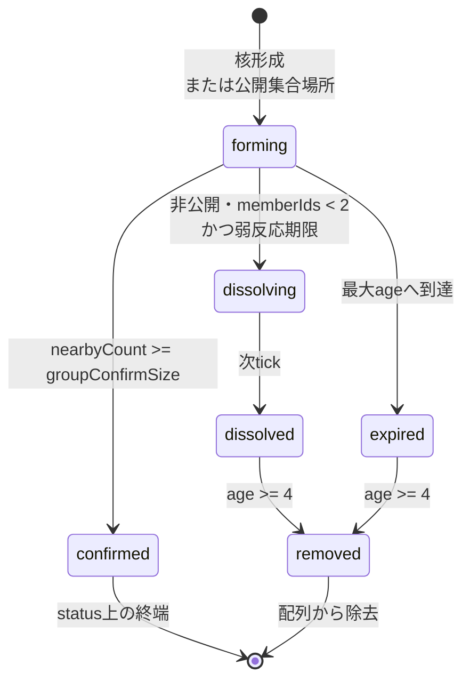

# UGSコアモデル: エージェントのミクロ力学と状態遷移

この文書は、UGSが仮定する「一人ひとりの意思決定から非公式なグループが形成されるまで」の
最小モデルを、実装に対応する数式・状態遷移・1 tickの処理順序としてまとめる。
発言の認知・解釈など個別機能の詳細は既存の設計文書へ委ね、ここではシミュレーション本体と
それらの接続点を一枚で追えることを目的とする。

> **モデルの境界**: これは実在の人の人格、心理、関係性、行動を診断・予測するモデルではない。
> 非公式な場で起こり得る力学を観察するための、説明可能で再現可能な数値仮説である。

## 1. モデルの全体像

シミュレーションは離散時間 `tick = 0, 1, 2, ...` で進む。世界は幅800、高さ520の2次元空間で、
各Agentは位置、固定特性、動的状態を持つ。Agentは形成中または成立済みの最寄りの
`GroupCandidate`だけを評価し、確率的に核形成・接近を選ぶ。確率判定と初期値にはseed付き
Mulberry32 PRNGを使うため、同じseed・入力・処理順序なら同じ結果になる。

モデルを構成する値は、次の4層に分かれる。

| 層 | 主な値 | 更新タイミング |
| --- | --- | --- |
| Agentの固定特性 | `willingness`, `initiative`, `ambiguityTolerance`, `influenceAvoidance`, `conformity`, `leaveThreshold`, `cliqueId`, `isObserverJoiner` | Agent生成時。実行中は更新しない |
| Agent / GroupCandidateの動的状態 | `state`, `stress`, 位置・速度, `joinedGroupId`, `memberIds`, `status`, `age` | 各tick |
| 場のパラメータ | `groupConfirmSize`, `ambiguityDuration`, `lateJoinEase`, `existingTieStrength`等 | UI設定と介入から実効値を解決。反映時期はパラメータごとに異なる |
| 一時的効果 | `invitedAtTick`, `SpeechActiveEffect` | 発生後の有限tickだけ有効。固定特性自体は変更しない |

初期Agentはすべて `state = undecided`, `stress = 0` で始まる。一般Agent、指定された主導者、
observerJoinerでは固定特性の初期分布が異なる。正確な範囲は
[`createInitialAgents`](../src/simulation/model.ts)を参照する。

## 2. 記号と共通演算

以下ではAgent `i`、GroupCandidate `g`、tick `t`について次の記号を使う。

| 記号 | 実装上の値 |
| --- | --- |
| `w_i` | `willingness` |
| `n_i` | `initiative` |
| `a_i` | `ambiguityTolerance` |
| `v_i` | `influenceAvoidance` |
| `c_i` | `conformity` |
| `L_i` | `leaveThreshold` |
| `s_i(t)` | `stress` |
| `T` | 実効 `existingTieStrength` |
| `D` | 実効 `ambiguityDuration` |
| `J` | 実効 `lateJoinEase` |
| `N` | 実効 `groupConfirmSize` |
| `x_i(t)` | Agentの2次元位置 |
| `x_g(t)` | GroupCandidateの2次元位置 |

共通演算は次のとおり。

```text
clamp(x, lo, hi) = min(hi, max(lo, x))
distance(a, b)   = sqrt((a.x - b.x)^2 + (a.y - b.y)^2)
Bernoulli(p)     = (seed付きPRNGが返す u in [0, 1) について u < p)
```

`SeededRandom.chance`自体は確率をclampしない。接近確率は明示的に `[0, 0.9]`へclampされ、
核形成確率は現在のパラメータ範囲と式によって実質的に0〜1へ収まる設計である。

## 3. 関係性は何を表し、何が変化するか

### 3.1 固定された既存関係性

現行モデルはAgent間の親密度行列や、個別の重み付き関係エッジを持たない。既存関係性は主に
次の2値で近似する。

- `cliqueId`: 同じ既存の仲良しグループに属するかを表すカテゴリ値
- `existingTieStrength = T`: 場全体で既存関係性がどれだけ強いかを表すグローバル値

初期生成時、`T < 0.35`ならcliqueを作らない。そうでなければ一般Agentのおよそ70%をseed付きで
並べ替え、`T > 0.6`なら3人、それ以外なら4人を目安にcliqueへ割り当てる。observerJoinerは
「既存関係を持たない参加者」としてこの割り当てから除外される。同一cliqueのAgentは共通の
中心付近へ初期配置される。

**`cliqueId`と`existingTieStrength`は実行中に学習・更新されない。** 発言回数、同席時間、合流、
離脱によって信頼・親密度・関係性が永続的に増減する処理はない。したがって本モデルで時間変化する
「関係」は、厳密には次の動的な所属または一時的な作用であり、永続的な対人関係の変化ではない。

- `joinedGroupId` / `GroupCandidate.memberIds`による、その場の輪への所属
- GroupCandidate内で現在優勢なcliqueと、その占有率
- 発言から導出され、有限tickだけ判断式へ加算される`SpeechActiveEffect`

### 3.2 dominant cliqueと部外者ペナルティ

候補 `g` の `memberIds` に含まれるAgentについてclique別人数を数え、最大のclique `k*` と
占有率 `r_g` を求める。cliqueを持たないメンバーも分母には含まれる。

```text
k*  = argmax_k count(member.cliqueId == k)
r_g = count(member.cliqueId == k*) / |memberIds_g|
q_g = clamp(2 * (r_g - 0.5), 0, 1)
```

cliqueを持つメンバーが1人もいなければdominant cliqueは存在せず、`r_g`, `q_g`は0相当として扱う。
Agent `i` がdominant cliqueの一員かを `same_i,g` とすると、魅力度に使う項は次のとおり。

```text
cliqueBonus_i,g    = same_i,g ? 0.5 * T : 0
outsiderPenalty_i,g = same_i,g ? 0 : 0.75 * T * q_g
```

占有率50%までは部外者ペナルティがなく、それを超えると滑らかに増える。これは既存関係性の
非対称な作用を表すが、候補への参加によって `T` や `cliqueId` が変わるわけではない。

### 3.3 発言解釈に使う基礎信頼も導出値

Phase 3の発言解釈では、話者と受け手が同一cliqueかどうかと `T` から基礎信頼を導出する。

```text
relationshipTrust = sameClique ? 0.5 + 0.5 * T
                               : 0.5 - 0.4 * T
```

これも保存・学習される信頼値ではない。毎回同じ固定関係から算出する係数である。詳細は
[発言解釈モデル](speech-interpretation-model.md)を参照する。

## 4. Agentに働くミクロ力学

### 4.1 核形成

核形成を試せるのは `undecided` の一般Agentだけで、observerJoinerは自ら核を作らない。
次のいずれかを満たす必要がある。

```text
hasInitiative_i = (n_i >= 0.5)

cliqueReady_i =
  cliqueId_iが存在
  && T > 0.5
  && 距離40未満に、同一cliqueかつundecidedの他Agentが2人以上いる
```

基本核形成確率は次のとおり。`numLeaders`は実効パラメータの主導者数である。

```text
p_form_base(i) =
  hasInitiative_i ? w_i * n_i * 0.08 * (1 + 0.15 * numLeaders)
                  : T * 0.1

p_form(i) = p_form_base(i) * m_form
```

通常は `m_form = 1`、`anonymous-low-pressure-intent`介入時だけ `m_form = 1.2`。
`Bernoulli(p_form(i))`が成功すると `forming`へ移る。距離40未満の既存のforming候補があれば
そこへ加わり、なければ現在位置に新しい候補を作る。

### 4.2 候補の魅力度

Agentは `forming` または `confirmed` のうち、ユークリッド距離が最小の候補を1つだけ評価する。
候補までの距離自体は魅力度や接近確率に入らず、「どれを選ぶか」にだけ使われる。

発言由来の魅力度補正を `E_A(i,g,t)` とする。これは`welcome`由来の現在有効な効果を集約した値で、
登録時の対象候補 `targetGroupId` が `g.id` と一致するときだけ加算される。

成立済み候補の魅力度:

```text
A_confirmed(i,g,t) = clamp(
    w_i * (0.5 + 0.5 * c_i)
  + 0.4 * J
  + interventionConfirmedBonus
  + cliqueBonus_i,g
  - outsiderPenalty_i,g
  + E_A(i,g,t),
  0, 1.5)
```

`interventionConfirmedBonus`は通常0、`predecided-venue`で0.25、`late-join-ok`で0.15。

形成中候補では、影響回避が「自分が場を動かしてしまう」抵抗として働く。

```text
influenceFactor_i,g = 1 - v_i * residual_i,g

A_forming(i,g,t) = clamp(
    w_i * c_i * influenceFactor_i,g
  + 0.5 * cliqueBonus_i,g
  - 0.5 * outsiderPenalty_i,g
  + E_A(i,g,t),
  0, 1.5)
```

`residual_i,g`は通常1、公開集合場所では0.4、軽い声かけの有効期間中は0.5である。
公開集合場所の条件が優先される。

### 4.3 接近確率と合流

最寄り候補の魅力度を `A(i,g,t)`、発言由来の接近確率補正を `E_P(i,t)` とすると:

```text
p_approach(i,g,t) = clamp(
  0.35 * A(i,g,t) * m_anonymous * m_invitation + E_P(i,t),
  0, 0.9)
```

- `m_anonymous = 1.25`: `anonymous-low-pressure-intent`かつ候補がforming。それ以外は1
- `m_invitation = 1.6`: 軽い声かけ後25 tickの有効期間内。それ以外は1
- `E_P`: `invite`由来の`SpeechActiveEffect`の集約値

成功すると `approaching`となり、候補IDを `joinedGroupId` に記録する。接近中は毎tick、速度14で
候補へ直線移動し、移動後の距離が26未満なら `joined`となって `memberIds`へ追加される。
接近先が消滅または非joinableになった場合は `undecided`へ戻る。

### 4.4 位置更新

対象位置 `y`、現在位置 `x`、速度定数 `speed` について、対象へ向かう移動は次の式に相当する。

```text
direction = (y - x) / max(||y - x||, 1)
velocity  = speed * direction
x_next    = clampToWorld(x + velocity)
```

`approaching`は速度14、`leaving`は16.8で移動する。`joined`は候補中心±18の乱数位置へ速度0.5で
漂い、`undecided`はx・yそれぞれに `[-0.5, 0.5)` のseed付き乱数を加えて漂う。forming候補の
中心もx・yそれぞれ `[-2, 2)`だけ揺らぐ。

### 4.5 stress蓄積と離脱

stressが蓄積するのは `undecided` の間だけである。forming、approaching、joinedへ動き出した後は、
曖昧さを理由とするstressを増やさない。

基本増分:

```text
delta_base(i,t) = w_i * (1 - a_i) * 0.007 / max(0.2, D)
```

observerJoinerに「歓迎される成立済みグループ」がない場合は、次を加える。

```text
delta_observer(i,t) = w_i * v_i * 0.0035 * m_no_destination / max(0.2, D)
```

通常、成立済み候補がdominant cliqueに50%超を占められ、かつAgentがそのclique外なら
「歓迎される」とみなさない。`late-join-ok`介入時はこのしきい値が85%へ上がる。
`m_no_destination`は通常1で、介入時は次の値になる。

| 介入 | `m_no_destination` |
| --- | ---: |
| `predecided-venue` | 0.4 |
| `short-ambiguity-window` | 0.5 |
| `anonymous-low-pressure-intent` | 0.6 |
| 有効期間中の`light-observer-invitation` | 0.35 |

発言由来のstress増分補正を `E_S(i,t)` とすると、更新式は次のとおり。

```text
s_i(t+1) = clamp(
  s_i(t) + delta_base(i,t) + observerならdelta_observer(i,t) + E_S(i,t),
  0, 1)
```

`greet`の正方向効果では `E_S` が負となり、増分を緩和する。stress自体が負になることはない。
発言由来の離脱しきい値補正を `E_L(i,t)` とすると:

```text
effectiveLeaveThreshold_i(t) = L_i + E_L(i,t)
leavingへ遷移                 iff s_i(t+1) > effectiveLeaveThreshold_i(t)
```

`L_i`本体は変更しない。`leaving`になったAgentは同じtickの後段から画面下へ移動し、
`y >= WORLD_HEIGHT - 6`で `left`になる。

## 5. GroupCandidateの成立・解散

形成中候補 `g` の周囲人数は、状態が `forming | approaching | joined` で、次のいずれかを満たす
Agentを数える。

```text
nearbyCount(g) = count(
  agent.id in memberIds_g
  || distance(agent, g) < 60
)
```

`nearbyCount(g) >= N`なら `confirmed`となる。候補の`memberIds`に含まれ、まだ`forming`だったAgentは
`joined`へ移り、`joinedGroupId`が設定される。距離60未満だがまだ接近中のAgentは成立人数には数えるが、
この時点で強制的に`joined`へは移さない。

成立しなければ `age`を1増やし、次を順に評価する。

```text
弱反応解散:
  !isPublicMeetingPoint && |memberIds| < 2 && age >= 15
  -> dissolving, age = 0

期限切れ:
  age >= 40
  -> expired, age = 0
```

`short-ambiguity-window`介入時は15と40をそれぞれ50%へ丸め、8 tickと20 tickに短縮する。
弱反応解散が先に評価される。`dissolving`は次tickに`dissolved`となる。`dissolved`と`expired`は
フェードアウト用にageを進め、ageが4以上になると配列から除去される。`confirmed`はGroupCandidateの
終端状態で、後からAgentが参加してもstatusは変わらない。

## 6. 状態遷移図

### 6.1 Agent



`joined`と`left`はシミュレーション終了判定上の決着状態である。ただし、未成立候補に合流した
`joined`は候補消滅時に `undecided`へ戻る。全Agentが `joined | left`になるか、tick 400に達すると終了する。

### 6.2 GroupCandidate



## 7. 介入と発言効果は基本式のどこへ作用するか

### 7.1 介入

介入は、`resolveEffectiveParams`でパラメータへ差分を加える経路と、engine内の特定項を補正する経路を
持つ。0〜1のパラメータは差分適用後にclampされる。

| 介入 | パラメータ差分 | engine内の主な補正 |
| --- | --- | --- |
| `explicit-meeting-point` | `ambiguityDuration +0.2`, `lateJoinEase +0.1` | 初期公開候補、forming魅力度の`residual = 0.4`、弱反応解散を免除 |
| `late-join-ok` | `lateJoinEase +0.3` | confirmed魅力度`+0.15`、歓迎判定50%→85% |
| `light-observer-invitation` | `observerInfluenceAvoidance -0.2`, `observerLeaveEase -0.1` | 条件成立時1回だけ、25 tickの間に接近倍率1.6、`residual = 0.5`、追加stress倍率0.35 |
| `short-ambiguity-window` | `ambiguityDuration +0.2` | 候補期限を50%へ短縮、追加stress倍率0.5 |
| `predecided-venue` | `lateJoinEase +0.15` | confirmed魅力度`+0.25`、追加stress倍率0.4 |
| `anonymous-low-pressure-intent` | `observerInfluenceAvoidance -0.3` | forming接近倍率1.25、核形成倍率1.2、追加stress倍率0.6 |

詳細は[`interventions.ts`](../src/simulation/interventions.ts)を参照する。

### 7.2 発言効果

発言効果を有効にした場合、発言は「認知→解釈→効果→active effect」の一方向パイプラインを通る。
現在のactive effectは受け手・作用次元ごとに上限付きで集約され、基本式へ次のように加算される。

| intent | 加算先 | 単一効果の最大基礎強度 | 持続 |
| --- | --- | ---: | ---: |
| `invite` | `E_P`: 接近確率 | 0.25 | 5 tick |
| `welcome` | `E_A`: 対象候補の魅力度 | 0.35 | 8 tick |
| `greet` | `E_S`: stress増分。正方向解釈では負値 | 0.03 | 6 tick |
| `decline` | `E_L`: 実効離脱しきい値 | 0.15 | 10 tick |

効果は線形減衰し、同一次元の累積は単一効果の基礎強度の3倍を上限とする。反対方向はnet化し、
同一話者・同一intentの再発言は古い効果を新しい効果で置換する。詳細は
[効果適用モデル](speech-effects-application-model.md)と
[競合・累積モデル](speech-effects-aggregation-model.md)を参照する。

重要なのは、発言によって `willingness`、`conformity`、`influenceAvoidance`、`leaveThreshold`、
`cliqueId`、`existingTieStrength`自体は変わらないことである。変わるのは有限期間の判断式の実効値だけである。

## 8. 1 tickの処理順序

`stepSimulation`は次の順序で評価する。順序は同一tick内の因果を定義するため、単なる実装詳細ではない。

1. 介入を反映した実効パラメータを解決する。
2. 前tickまでの`SpeechActiveEffect`を現在tickへ線形減衰させ、期限切れを除去する。
3. `undecided`のAgentについて核形成を判定する。
4. 軽い声かけ介入の発生条件を判定する。
5. 残っている`undecided`のAgentについて、最寄り候補への接近を判定する。
6. `approaching`を移動し、到着したAgentを`joined`にする。
7. forming候補の中心、`joined`、`undecided`の位置を更新する。
8. `undecided`のstressを更新し、離脱開始を判定する。
9. `leaving`を画面下へ移動し、到達したAgentを`left`にする。
10. GroupCandidateの成立、弱反応解散、期限切れを判定する。
11. 所属先を失った`forming | joined`を`undecided`へ戻し、終端候補を掃除する。
12. 全Agentの決着またはtick 400による終了を判定する。
13. 状態の前後差分から追加の`SpeechEvent`を導出する。
14. このtickの発言について認知、解釈、効果生成、active effect登録を行う。

**手順14で登録された効果は、このtickですでに完了した手順3〜10には遡及しない。次tickの手順2で
初めて減衰・期限判定されたうえで参照される。** この境界により、発言生成と状態更新の循環や、
同一tick内の暗黙な順序依存を避けている。

## 9. 実装へのトレーサビリティ

| モデル要素 | 実装 |
| --- | --- |
| 型、Agent / GroupCandidateの状態 | [`types.ts`](../src/simulation/types.ts) の `AgentState`, `Agent`, `GroupCandidateStatus`, `GroupCandidate` |
| 初期特性、clique割り当て、初期位置 | [`model.ts`](../src/simulation/model.ts) の `assignCliques`, `createInitialAgents` |
| 乱数と確率判定 | [`random.ts`](../src/simulation/random.ts) の `SeededRandom` |
| dominant clique、魅力度 | [`engine.ts`](../src/simulation/engine.ts) の `dominantClique`, `attractiveness` |
| 核形成、接近、stress、離脱、候補ライフサイクル | [`engine.ts`](../src/simulation/engine.ts) の `stepSimulation` |
| 介入パラメータと一時補正 | [`interventions.ts`](../src/simulation/interventions.ts) の `resolveEffectiveParams` と各介入定数 |
| 発言イベント | [`speech.ts`](../src/simulation/speech.ts) の `deriveSpeechEvents` |
| 発言の認知・解釈・効果・集約 | [`speechEffects.ts`](../src/simulation/speechEffects.ts) |

関連する詳細文書:

- [発言イベントと既存介入の境界](speech-event-intervention-boundary.md)
- [発言の距離ベース認知](speech-reception-distance-model.md)
- [受け手別の発言解釈](speech-interpretation-model.md)
- [発言効果の適用・減衰](speech-effects-application-model.md)
- [複数発言効果の競合・累積](speech-effects-aggregation-model.md)
- [発言効果のpaired Monte Carlo比較](speech-effects-paired-monte-carlo.md)

## 10. 意図的にモデル化していないもの

- 個人間の親密度・信頼の学習と永続更新
- 過去の合流・離脱・発言履歴による性格特性の変化
- 全候補を同時比較する選択や、距離を連続的に含む魅力度
- 衝突回避、遮蔽物、方向、騒音などの精密な物理モデル
- 現実世界での係数の妥当性や統計的効果量の主張

これらを将来導入する場合は、現行の固定関係・固定特性・最寄り候補のみという前提を変更するため、
新しいモデル仮説として数式、状態、検証方法を別途定義する必要がある。
